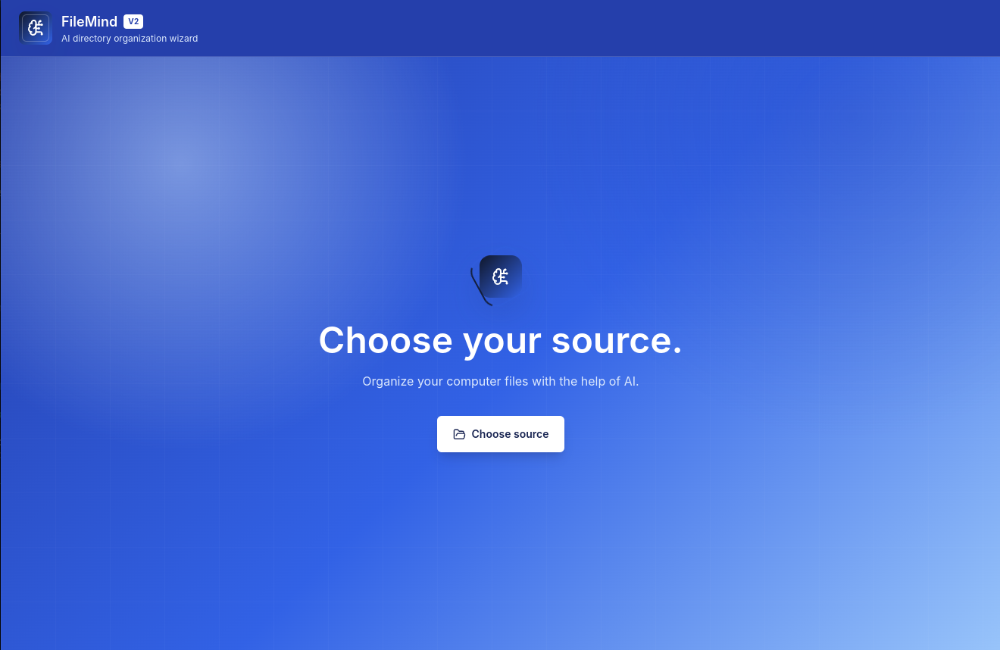
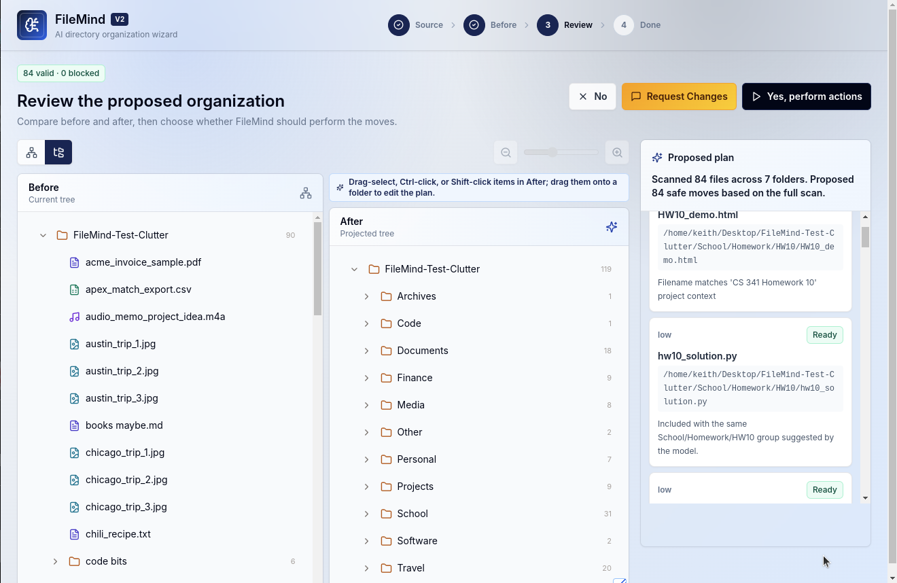
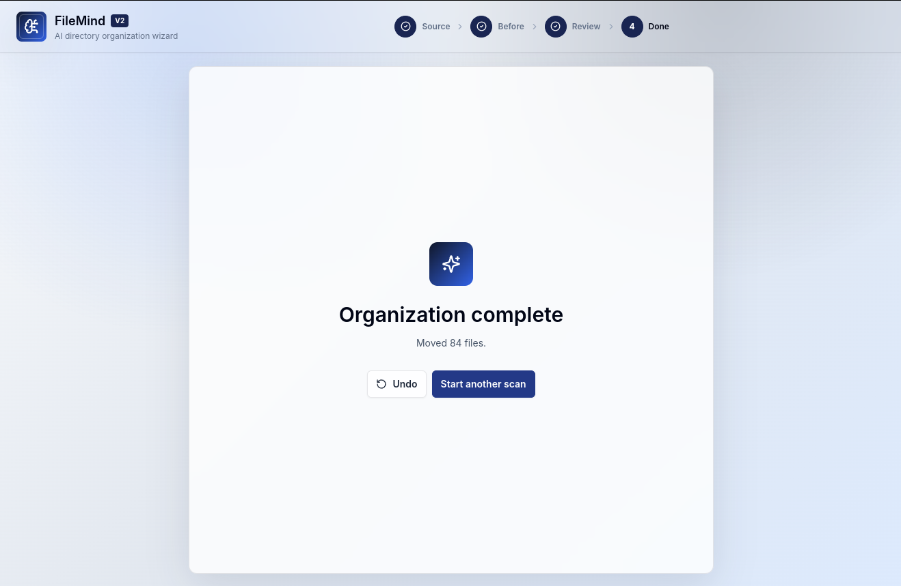

# FileMind

FileMind is a desktop AI file manager for safely reorganizing local folders. It opens as an Electron app, walks you through a V2 organization wizard, scans one or more source directories, asks a local Ollama model for a plan, previews the before/after layout, lets you revise or manually adjust the proposal, and only moves files after you confirm.

Ollama runs locally in the background. FileMind does not use hosted AI models.

## Screenshots





## What You Need

- Node.js 20 or newer
- npm
- Ollama installed locally

## Install Ollama

Download Ollama from:

https://ollama.com/download

After installing it, start Ollama. On most systems it runs automatically. You can check it from a terminal:

```bash
ollama --version
```

## Local Models

On launch, FileMind checks Ollama for its two supported local models and automatically downloads any that are missing:

```bash
ollama pull qwen3:14b
ollama pull qwen3:4b
```

In the app, `qwen3:14b` appears as **High Effort** and `qwen3:4b` appears as **Low Effort**. High Effort is recommended when your computer can comfortably run the larger model; Low Effort is faster for smaller machines.

The first launch can take a while because High Effort is large. If both models are already installed, FileMind skips the download. Ollama automatically uses supported GPU acceleration when it can, and FileMind asks Ollama to offload model layers to the GPU where available.

## Install From Source

From this folder:

```bash
npm install
```

## Run The Desktop App

```bash
npm start
```

This launches the FileMind desktop window. During development, Electron also starts a local renderer server behind the scenes. You do not need to open that server in your browser.

## Use FileMind

1. Choose one or more source directories.
2. Confirm whether FileMind should read short text previews for AI context. Scans include hidden files and recurse through selected directories without a depth limit.
3. Click **Scan**.
4. Review the current directory map or tree.
5. Pick **High Effort** or **Low Effort** from the local model dropdown next to **Generate**.
6. Click **Generate**.
7. Review the proposed before/after organization, blocked moves, and move reasons.
8. Optional: click **Request Changes** to regenerate the plan with extra instructions.
9. Optional: in the after view, drag-select, Ctrl-click, or Shift-click items and drag them onto another folder to manually edit the plan.
10. Choose **Yes, perform actions** only when you are ready.

After applying moves, FileMind writes an undo manifest so the last applied plan can be undone from the app.

## Current Features

- Local-only Ollama planning with High Effort and Low Effort model choices.
- Automatic first-run model installation for supported local models.
- Recursive directory scanning with counts for files, folders, bytes, and skipped items.
- Optional text snippets from common text/code formats for better organization context.
- Retrieval-style local indexing that prioritizes projects, assignments, clients, and semantic groups before simple file-type buckets.
- Deterministic fallback planning when an AI response is unusable.
- Plan validation that blocks unsafe moves outside selected roots, duplicate destinations, invalid path segments, root-folder moves, and existing destinations.
- Animated map and tree visualizations for current and proposed layouts.
- Resizable before/after comparison view with zoom controls.
- Image preview support for common image formats up to 25 MB.
- Confirm-before-open flow for opening files in the system file manager.
- Request-changes flow for AI revisions.
- Manual drag editing in the proposed after tree.
- Apply confirmation, partial failure reporting, and undo support through move manifests.

## Developer Commands

```bash
npm test
npm run build
npm run check
```

- `npm test` runs the test suite.
- `npm run build` type-checks and builds the Electron app files.
- `npm run check` runs tests and verifies the local build.

## Privacy

FileMind is designed for local use:

- Directory scanning happens on your machine.
- Ollama runs on your machine.
- FileMind does not include hosted AI models.
- FileMind does not send scan metadata or text previews to any hosted model service.
- Text previews are read locally by default for supported text files so FileMind can understand more than filenames. You can turn this off before scanning.

## If Ollama Is Not Detected

Start Ollama and make sure it is reachable at:

```text
http://localhost:11434
```

Then reopen FileMind. Once Ollama is reachable, FileMind will install the missing local models automatically.
